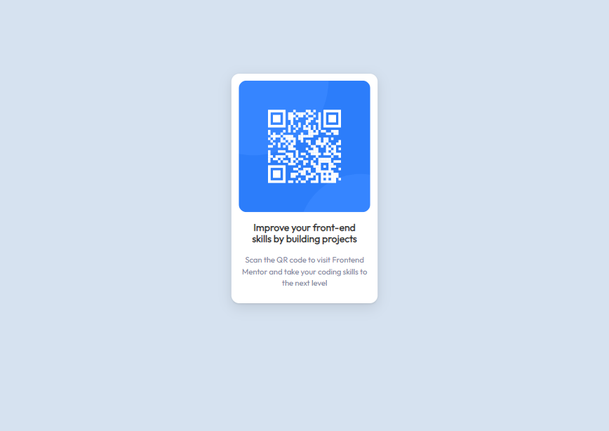
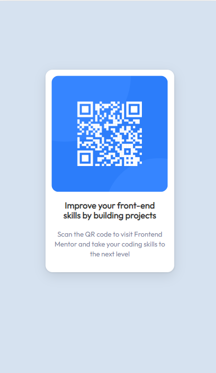

# Frontend Mentor - QR code component solution

This is a solution to the [QR code component challenge on Frontend Mentor](https://www.frontendmentor.io/challenges/qr-code-component-iux_sIO_H). Frontend Mentor challenges help you improve your coding skills by building realistic projects. 

## Table of contents

- [Overview](#overview)
  - [Screenshot](#screenshot)
  - [Links](#links)
  - [Built with](#built-with)
  - [What I learned](#what-i-learned)
- [Author](#author)

**Note: Delete this note and update the table of contents based on what sections you keep.**

## Overview

### Screenshot

The first Screenshot is Desktop View. The second is Mobile View.
### Links

- Solution URL: [URL](https://github.com/chaudmah/qr-component-main/blob/master/index.html)

### Built with

- Semantic HTML5 markup. All stylizing is in the index file.

### What I learned

I learned to import Google Fonts.

## Author
- Frontend Mentor - [@chaudmah](https://www.frontendmentor.io/profile/chaudmah)
